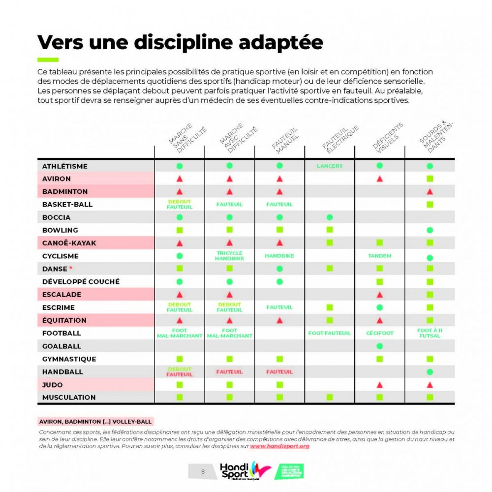
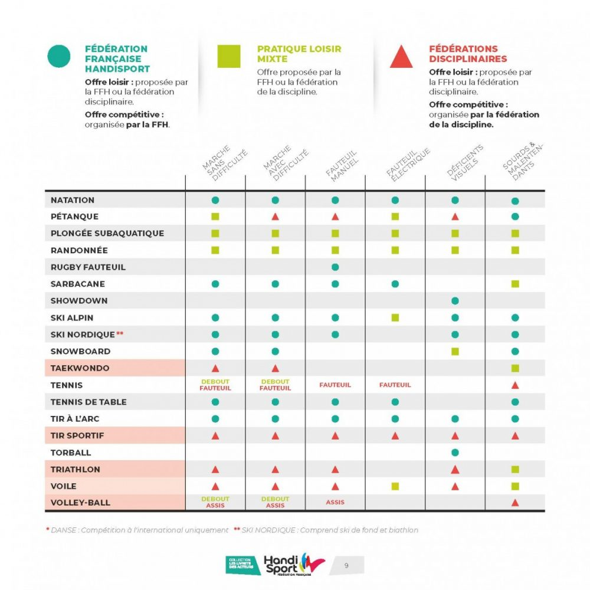

```{r setup, include=FALSE}
knitr::opts_chunk$set(echo = FALSE,message=FALSE, warning=FALSE)
```

```{r packages, include=FALSE, paged.print=FALSE}
library(data.table)
library(plotly)
library(dplyr)
library(heatmaply)
library(xgboostExplainer)
library(iml)
library(rpart.plot)
```

```{r functions,include=FALSE, paged.print=FALSE}
source("utils/custom_funs.R",local = T,encoding = "UTF-8")
source("utils/feature_eng.R",local = T,encoding = "UTF-8")
```

```{r data-loading, include=FALSE, paged.print=FALSE}
handicap = fread("../data/data-es.csv",encoding = "UTF-8")
```

```{r featuring, include=FALSE, paged.print=FALSE}
inplace_recode_features(handicap)

```


```{r export pour carto, eval=FALSE, include=FALSE, paged.print=FALSE}
data_carto <- fix_names_encoding(handicap)
data_carto <- data_carto[,.(coordonnees,acces_aire_jeu_hm,acces_aire_jeu_hs,Email_de_la_personne_ressource,Nom_de_l.equipement_sportif,Nom_de_l.installation_sportive,Nom_de_la_personne_ressource,DEP,Famille_d.equipement_sportif,Type_d.equipement_sportif)]
fst::write_fst(data_carto,"../../accessible_handicap_app/data/handicap_carto.fst")
```

```{r vars_selection, include=FALSE, paged.print=FALSE}
# names(handicap)
# Revue manuelle des variables disponibles. Principalement des variables catégorielles ou binaires. Certaines multimodales sont mal codées (pb d'ordre). Les variables quanti sont spécifiques aux disciplines ou à la jauge (gradins, nb locaux)
source("utils/vars_categ_manuelle.R",local = T,encoding = "UTF-8")

remaining = handicap[, -c(
  IDs,
  metadata_survey,
  Geo,
  data_perso,
  Indic_Access,
  weird,
  vars_useless,
  redondant,
  a_tester,
  a_tester_recodee,
  a_recoder,
  dates_a_tester,
  specifique_stade,
  specifique_ski,
  specifique_athletisme,
  specifique_aquatique
), with = F]
# dput(names(remaining))
# sapply(remaining,uniqueN)
```


<style type="text/css">
.lang-small_size {  
font-size: 12px;
}
</style>


## Accessibilité aux personnes en situation de handicap

Une étude critique du respect du cadre juridique d'accessibilité aux handicapés

Scorer et classifier les établissements pouvant accueillir les personnes en situations de handicap

## Livrables

- Scripts de nettoyage des données (fonctions dédiées)
- Rapport d'étude
- Algorithmes de classification de l'accessibilité des établissements
- Interprétation des résultats des algorithmes de classification
- [Application Web de localisation des Etablissements Sportifs](https://arifelk.shinyapps.io/accessible_handicap_app/)
- Le code source de [l'application](https://github.com/phileas-condemine/map_accessibilite_handicap) et de [l'étude](https://github.com/phileas-condemine/accessible_handicap)

## Documentation

[A propos des données](https://equipements.sports.gouv.fr/pages/plus-dinfos/)

[Le cadre juridique](https://www.sports.gouv.fr/pratiques-sportives/equipements-et-sites/reglementation/Accessibilite-des-equipements-sportifs)

**"Les ERP doivent être [...] accessibles à tous, quel que soit le type de handicap notamment physique, sensoriel, cognitif, mental ou psychique."**

## Revue de littérature, quasi-nullité d'exploitations RES + Handicap

- [**Analyse par département sans référence à l'accessibilité**] [Atlas francilien du recensement des équipements sportifs](https://ile-de-france.drjscs.gouv.fr/spip.php?article1100)
- [**3 occurrences "handicap" en aparté - idée : focus sur grand-jeu, salles polyvalentes & gymnases**] [Les équipements sportifs du Grand Est](https://www.insee.fr/fr/statistiques/3197322)
- [**Contexte rural - uniquement problématique du temps d'accès**] [Dossier Pays du Lunévillois](https://www.insee.fr/fr/statistiques/3195833)
- [**Accessibilité aux handicapés 58% ZUS vs 54% !ZUS**] [L’offre en Zones urbaines sensibles](https://www.sports.gouv.fr/IMG/pdf/etudeeszus_synthese_oct2014.pdf)

[Bibliographie complète du RES](https://www.sports.gouv.fr/spip.php?page=imprimer&id_article=15715)

[Un seul document sur 81 qui mentionne "handicap" dans le titre](https://ile-de-france.drjscs.gouv.fr/sites/ile-de-france.drjscs.gouv.fr/IMG/pdf/SynthesePiscines11janvier12-2.pdf)

## Hypothèses

- Il ne s'agit pas d'un projet juridique, l'objectif n'est donc pas d'étudier le cadre juridique des normes d'accessibilité en France.
- On se propose pas la suite de comparer les établissements en termes d'accessibilité afin de permettre d'identifier les établissements défaillants.

## Avertissement - Qualité des données

Tout projet de data-science devrait commencer par une **analyse de la qualité des données**.

- Données mal codées : 
  - Ordre permuté dans les listes (Type d'utilisation, Types de locaux complémentaires...)
  - Espaces en trop (Période de mise en service : 1975-1984 vs 1975 - 1984)
  - Variable numérique (Emprise foncière de l'installation : des espaces, des points, des virgules, des m², m2, hectares, ha...)
- Données incertaines : variable "Etat de la fiche d'enquête", modalité non-validée.

## Distribution des établissements par famille d'équipement sportif

```{r distr familles, paged.print=FALSE}
# handicap[,.N,by=.(`Type d'équipement sportif`)]
ax <- list(
  title = "",
  showticklabels = FALSE,
  showgrid = FALSE
)
count_and_plot(handicap,"Famille d'équipement sportif")%>%plotly::layout(xaxis = ax, yaxis = ax)
```
## Variables qualifiant l'accessibilité

```{r  paged.print=FALSE}
nm = names(handicap)
# grep("access",nm,value=T,ignore.case = T)
# grep("handicap",nm,value=T,ignore.case = T)
vars = grep("(handicap)|(access)",nm,value=T,ignore.case = T)


stats_var_handicap_access = handicap[, c(.(stat = c("not_na","avg","min","max","nb_mod")),lapply(.SD, function(x)
  c(
    not_na = show_pct(mean(!is.na(x))),
    avg = show_pct(mean(x, na.rm = T)),
    min = min(x, na.rm = T),
    max = max(x, na.rm = T),
    nb_mod = uniqueN(x)
  ))), .SDcols = vars]

DT::datatable(stats_var_handicap_access, 
              extensions = 'FixedColumns',
              options = list(
                dom = 't',
                scrollX = TRUE,
                fixedColumns = TRUE
              ),
              rownames = F
)

```
## Choix des critères d'accessibilité

On s'intéresse en priorité aux critères bien renseignés (taux de valeurs manquantes faible).

On peut distinguer le sport comme pratique ou comme spectacle. 

**En matière de santé publique, l'accès à la pratique prévaut.**

Par ailleurs la proportion des établissements "accessibles" dans l'ensemble est un élément important.

On distingue un **écart colossal d'accessibilité aux handicapés moteurs (55%) vs sensoriels (3%)**

On retrouve cette séparation des handicaps sensoriels vs moteurs dans la CAH des corrélations.

## Corrélation entre les critères d'accessibilité - séparation nette moteur / sensoriel 

```{r}
vars_handicap_bin = melt(stats_var_handicap_access,id.vars = "stat")[stat=="nb_mod" & value <= 3]$variable
vars_handicap_bin = as.character(vars_handicap_bin)
vars_handicap_bin = setdiff(vars_handicap_bin,c("Accessibilité juridique"))

data_for_corr = data.frame(handicap[,vars_handicap_bin,with=F])
corr_mat = cor(data_for_corr,use = "pairwise.complete.obs")
heatmaply_cor(corr_mat,showticklabels = F)
```


## Choix de la problématique

Les écarts d'accessibilité à la pratique sportive aux handicapés moteurs vs sensoriels

- Accessibilité aux personnes à mobilité réduite à l'aire de jeu
- Accessibilité aux personnes en situation de handicap sensoriel à l'aire de jeu

## Les handisports (1/2)

```{r}

```


## Les handisports (2/2)

```{r}

```

## Des activités adaptées aux handicapés moteurs ou sensoriels

- Ski
- Natation
- Canoë
- Tir
- Danse
- Musculation
- Athlétisme


## Accessibilité par famille d'établissement

Des taux d'accessibilités très variables d'une famille d'équipement à l'autre.

```{r include=FALSE}
setnames(handicap,"Accessibilité aux personnes à mobilité réduite à l'aire de jeu","acces_aire_jeu_hm")
setnames(handicap,"Accessibilité aux personnes en situation de handicap sensoriel à l'aire de jeu","acces_aire_jeu_hs")
```

```{r}

var2 = "Type d'équipement sportif"
var = "Famille d'équipement sportif"
stats = handicap[, .(.N, 
                     tx_access_hm = mean(acces_aire_jeu_hm, na.rm = T),
                     tx_access_hs = mean(acces_aire_jeu_hs, na.rm = T)
), by = var]
stats[,prop := N/sum(N)]
setnames(stats,var,"x")
setorder(stats,-N)
stats[,x:=factor(x)]
stats[,x:=forcats::fct_inorder(x)]
plot_ly(data=stats,x=~x,y=~prop,type = "bar",name = "Distribution")%>%
  add_lines(y=~tx_access_hm,name="OK H. Moteur")%>%
  add_lines(y=~tx_access_hs,name="OK H. Sensoriel")%>%
  layout(hovermode = "x unified")

```


```{r eval=FALSE, include=FALSE}
pick_famille = c("Terrain de grands jeux","Plateau EPS","Salle multisports","Salle non spécialisée","Equipement équestre","Salle ou terrain spécialisé","Equipement d'activités de forme et de santé")

var2 = "Type d'équipement sportif"
var = "Famille d'équipement sportif"

for (one_famille in pick_famille){
  stats = handicap[`Famille d'équipement sportif`  == one_famille, .(.N, 
                       tx_access_hm = mean(acces_aire_jeu_hm, na.rm = T),
                       tx_access_hs = mean(acces_aire_jeu_hs, na.rm = T)
  ), by = var2]
  stats[,prop := N/sum(N)]
  setnames(stats,var2,"x")
  setorder(stats,-N)
  stats[,x:=factor(x)]
  stats[,x:=forcats::fct_inorder(x)]
  plot_ly(data=stats,x=~x,y=~prop,type = "bar",name = "Distribution")%>%
    add_lines(y=~tx_access_hm,name="OK H. Moteur")%>%
    add_lines(y=~tx_access_hs,name="OK H. Sensoriel")%>%
    layout(hovermode = "x unified",title=one_famille)
}
```


## Accessibilité par type d'établissement

Des taux d'accessibilités très variables d'un type d'équipement à l'autre.

```{r}

var2 = "Type d'équipement sportif"
stats = handicap[, .(.N, 
                     tx_access_hm = mean(acces_aire_jeu_hm, na.rm = T),
                     tx_access_hs = mean(acces_aire_jeu_hs, na.rm = T)
), by = var2]
stats[,prop := N/sum(N)]
setnames(stats,var2,"x")
setorder(stats,-N)
stats[,x:=factor(x)]
stats[,x:=forcats::fct_inorder(x)]
plot_ly(data=stats,x=~x,y=~prop,type = "bar",name = "Distribution")%>%
  add_lines(y=~tx_access_hm,name="OK H. Moteur")%>%
  add_lines(y=~tx_access_hs,name="OK H. Sensoriel")%>%
  layout(hovermode = "x unified")

```

## Des variables spécifiques par type d'établissement

Athlétisme, ski, natation, activités aquatiques ~~& aériennes~~.

```{r}
ax <- list(
  # title = "",
  showticklabels = FALSE,
  showgrid = FALSE
)
var = "Famille d'équipement sportif"
stats_na_by_group = handicap %>% 
  group_by(`Famille d'équipement sportif`) %>% 
  summarise_all(~mean(!is.na(.))) %>% 
  setDT %>%
  melt(id.vars=var,value.name = "not_na")

plot_ly(data = stats_na_by_group,type="heatmap",x=~`Famille d'équipement sportif`,y=~variable,z=~not_na)%>%layout(xaxis = ax, yaxis = ax)
```

## Une amélioration progressive du respect des normes d'accessibilité

Mesuré avec un modèle logistique sur 9530 équipements d'athlétisme.

```{r}
coeffs = readRDS("../data/athletisme_effet_annee_construction_OK_PRATIQUE_HM.rds")
ax <- list(title = "", showticklabels = FALSE, showgrid = FALSE)
plot_margin(coeffs = coeffs,pattern = "^Periode_de_mise_en_service",.01)%>%layout(xaxis=ax)
```
## Approche généraliste

Pour continuer d'appréhender les données, on entraîne des modèles généralistes sur les variables communes aux différents types d'équipements.

Faute de temps pour tout explorer, on se concentre sur l'accessibilité aux aires de jeu pour les handicapés moteurs.

Pour tenir compte de toute la diversité des ES on construit le jeu d'entraînement de 100,000 observations par tirage stratifié par famille d'ES.

## Objectif

Fournir au bureau compétant un outil d'aide à la décision pour identifier les "mauvais élèves" ie non accessibles alors que les établissements similaires sont plutôt accessibles.

Fournir au site [https://www.handiguide.sports.gouv.fr/](mailto:handiguide@sports.gouv.fr) une liste des "bons élèves" ie les établissements accessibles malgré la pauvreté de l'offre dans les établissements similaires.

Pour aller plus loin, on pourrait fournir un outil de recherche d'alternative (complémentaire à https://www.handiguide.sports.gouv.fr/) qui permet de voir tous les ES par famille > type puis 1) trouver facilement les établissements accessible par handicap 2) référencer ceux qui ne le sont pas et mettre un lien direct pour leur envoyer un email demandant la mise aux normes (champ `Email de la personne ressource` + web-scrapping). [Le lien ici](https://arifelk.shinyapps.io/accessible_handicap_app/)

## Feature Engineering

En plus de la correction des variables multi-catégorielles et numériques mal codées, on remplace également certaines variables multi-modales par la valeur moyenne de la cible calculée sur le jeu d'entraînement pour éviter le *data leakage*.

Le taux d'accessibilité moyen par famille d'établissement donne une AUC à 67.8% (sur les données de test).

## Arbres de décision - AUC 71.7%

Permet de continuer de découvrir des variables mal codées et d'identifier en priorité les variables les plus pertinentes. 

```{r}
load("../data/rpart_cp001.RData")
rpart.plot::rpart.plot(model)

```

## 2-Step GLM modalités significatives - AUC 73.3%

Modèle de référence en termes d'interprétabilité.

```{r}
load("../data/coeffs_2stepGLM.RData")
DT::datatable(coeffs, 
              options = list(
                dom = 'tip',
                language = list(url = '//cdn.datatables.net/plug-ins/1.10.11/i18n/French.json')
              ),
              rownames = F
)
```
## Gradient boosting (GBM) - AUC 74.1% (1/2)

Inteprétation de la contribution des variables pour les erreurs les plus extrêmes ([SHAPLEY](https://christophm.github.io/interpretable-ml-book/shapley.html) répartition des contributions)

```{r}
load("../data/shapley_wfn_wfp_gbm.RData")

ax <- list(title = "", showticklabels = FALSE, showgrid = FALSE)

{gshapley_wfn+ theme(
  axis.text.y = element_blank(),
  axis.ticks = element_blank())+ggtitle("SHAPLEY - Pire faux négatif (bon élève)")}%>%ggplotly()

```
## Gradient boosting (GBM) (2/2)

- Pas de parking handicapé : contribution négative
- Lieu bien équipé : sanitaires, vestiaires chauffés, salle de cours, locaux complémentaires.
- Et pourtant non accessible aux handicapés moteurs.

```{r}
{gshapley_wfp+ theme(
  axis.text.y = element_blank(),
  axis.ticks = element_blank())+ggtitle("SHAPLEY - Pire faux positif (mauvais élève)")}%>%ggplotly()
```


## Extreme Gradient Boosting (XGBoost) - AUC 80.0% 

Params : 

- sample rows : 70%
- sample cols : 50%
- eta : 0.1
- min_child_weight : 10 (>10 obs par feuille)
- max-depth : 6
- nb_trees : 1500

On pourrait 

- améliorer avec une grid-search (BayesianSearch ? l'entraînement est quand même lent !)
- ajouter des contraintes de monotonie, en particulier sur les variables de target-encoding
- créer de nouvelles features, à commencer par un target encoding plus complet (quand il y a trop peu d'observations...)
- recoder les variables numériques en déciles (factor) pour intepréter plus facilement les waterfalls.


## Extreme Gradient Boosting (XGBoost) - Waterfall (1/2)

Interprétation à l'aide d'un diagramme *waterfall* en triant les contributions en valeur absolue grâce à [xgboostExplainer](https://github.com/AppliedDataSciencePartners/xgboostExplainer)


```{r}
load("../data/waterfall_wfn_wfp_xgb.RData")
xgbexp_wfn %>% ggplotly()

```

## Extreme Gradient Boosting (XGBoost) - Waterfall (2/2)


```{r}
xgbexp_wfp %>% ggplotly()

```
## Un outil pour trouver les établissements accessibles

[L'outil](https://arifelk.shinyapps.io/accessible_handicap_app/)

- Identifier les établissements accessibles par catégorie
- Identifier ceux qui ne sont pas accessibles et les contacter (adresse email dans le popup)
- Pour améliorer : 
  - intégrer le score pour qualifier les bons/mauvais élèves. API plumber ou variable prédiction.
  - ajouter des données externes
  - meilleure UX pour le choix famille > type d'établissement
  - alternative à la recherche par département : rayon de XX km autour d'un point placé sur la carte
  - intégrer d'autres handicaps
